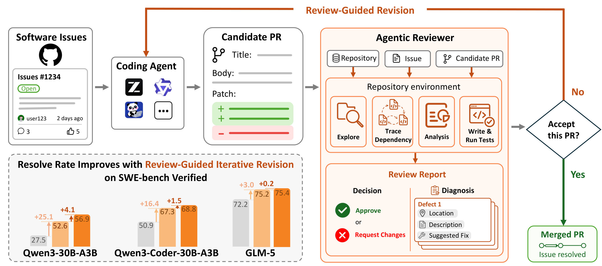

<h1 align="center"> SWE-Review: Closing the Loop on Issue Resolution with Agentic Code Review </h1>

<p align="center">
<a href="https://github.com/SWE-Lego/SWE-Review/blob/main/assets/paper.pdf" > 📖 Paper</a>
•
<a href="https://swe-lego.github.io/SWE-Review/" > 🌐 Project Page</a>
•
<a href="https://huggingface.co/datasets/SWE-Lego/SWE-Review-Bench" > 📊 Benchmark</a>
•
<a href="https://huggingface.co/collections/SWE-Lego/swe-review" > 🤗 Datasets & Models</a>
•
<a href="https://github.com/SWE-Lego/cc-swe-review" > 🔌 Claude Code Plugin</a>
</p>

<p align="center">
    <br>
    
    <br>
</p>

**SWE-Review** turns one-shot PR generation into closed-loop issue resolution with agentic code review. Given an AI-generated PR, a reviewer agent explores the repository, decides whether the PR should be accepted, and provides structured feedback for revision.

Key results on SWE-bench Verified:
- **Agentic review continuously improves PRs**: resolve rate rises from 27.5% to 56.9% (Qwen3-30B-A3B) through iterative review-revision
- **Agentic > single-turn review**: outperforms fixed-context baselines in both Decision Accuracy and Resolve Rate after Revision
- **Review trajectories improve issue resolution**: mixed training raises resolve rate by up to 5.6pp and enables self-contained review-revise loops (+10.6pp)
- **Effective test-time scaling**: review-guided iterative revision reaches 38.4% with only 2.44 samples on average

## Demo

> ▶ SWE-Review in action — resolving a real GitHub issue with the generate–review–revise loop, powered by the [Claude Code plugin](https://github.com/SWE-Lego/cc-swe-review).

<p align="center">
    
</p>

## Released Resources

| Resource | Link | Description |
|----------|------|-------------|
| SWE-Review-Bench | [HuggingFace](https://huggingface.co/datasets/SWE-Lego/SWE-Review-Bench) | 1,384 AI-generated PRs across 3 quality tiers |
| SWE-Review-Traj | [HuggingFace](https://huggingface.co/datasets/SWE-Lego/SWE-Review-Traj) | 8,914 decision-correct + 5,242 decision-incorrect review trajectories |
| SWE-Review-8B | [HuggingFace](https://huggingface.co/SWE-Lego/SWE-Review-8B) | Qwen3-8B fine-tuned reviewer |
| SWE-Review-30B-A3B | [HuggingFace](https://huggingface.co/SWE-Lego/SWE-Review-30B-A3B) | Qwen3-30B-A3B fine-tuned reviewer |
| Claude Code Plugin | [GitHub](https://github.com/SWE-Lego/cc-swe-review) | Use SWE-Review directly in Claude Code |

## Repo Structure

```
SWE-Review/
├── SWE-Review-Bench/       # Benchmark evaluation (scripts, metrics, README)
├── scripts/
│   ├── train/              # Training scripts (serve, sft, review, eval)
│   └── data_pipeline/      # Data download and preparation
├── harbor/                 # Agent orchestration framework (local install)
├── configs/                # LLaMA-Factory training configs
├── prompts/                # All prompts used in the paper (verbatim)
└── SWE-bench/              # SWE-bench evaluation harness (local install)
```

---

## 1. 📦 Installation

```bash
git clone https://github.com/SWE-Lego/SWE-Review.git
cd SWE-Review
```

#### 1.1 vLLM environment (model serving)
```bash
conda create -n vllm python=3.12 -y
conda activate vllm
pip install vllm
```

To serve a reviewer model (e.g., SWE-Review-8B):
```bash
conda activate vllm
python -m vllm.entrypoints.openai.api_server \
    --model SWE-Lego/SWE-Review-8B \
    --served-model-name SWE-Review-8B \
    --host 0.0.0.0 --port 8000 \
    --tensor-parallel-size 4 \
    --gpu-memory-utilization 0.9 \
    --max-model-len 131072 \
    --enable-auto-tool-choice \
    --tool-call-parser hermes \
    --chat-template-content-format string \
    --api-key dummy-key
```

#### 1.2 Harbor environment (agent execution & evaluation)
```bash
conda create -n harbor python=3.12 -y
conda activate harbor

cd harbor && pip install -e . && cd ..
cd SWE-bench && pip install -e . && cd ..
pip install openhands-ai
```

#### 1.3 LLaMA-Factory environment (training)
```bash
conda create -n lf python=3.12 -y
conda activate lf

pip install torch==2.8.0 torchvision==0.23.0 torchaudio==2.8.0 --index-url https://download.pytorch.org/whl/cu128

# DeepSpeed requires CUDA toolkit (nvcc). If CUDA_HOME is not set:
conda install -c nvidia cuda-toolkit=12.8 -y
export CUDA_HOME=$CONDA_PREFIX

pip install deepspeed --no-build-isolation
pip install llamafactory[metrics,liger-kernel]

wget https://github.com/Dao-AILab/flash-attention/releases/download/v2.8.3/flash_attn-2.8.3+cu12torch2.8cxx11abiFALSE-cp312-cp312-linux_x86_64.whl
pip install flash_attn-2.8.3+cu12torch2.8cxx11abiFALSE-cp312-cp312-linux_x86_64.whl
```

---

## 2. 📊 Benchmark Evaluation

Evaluate any reviewer model on SWE-Review-Bench. See [`SWE-Review-Bench/README.md`](SWE-Review-Bench/README.md) for full details.

**Prerequisites**: Docker (for Harbor agent execution), GPU (for vLLM model serving), two conda environments (`vllm` + `harbor`).

**Required environment variable** (must be set before running Harbor):
```bash
export OPENHANDS_LLM_NATIVE_TOOL_CALLING=true
```

**Mode 1: API** — reviewer is already served (e.g., remote API or manually deployed vLLM):
```bash
conda activate harbor
export OPENHANDS_LLM_NATIVE_TOOL_CALLING=true

# Reviewer via API, revision models deployed locally (Qwen) or via API (GLM-5)
bash SWE-Review-Bench/run_full_benchmark.sh --mode api \
    --reviewer-model openai/claude-opus-4-7 \
    --api-key "your-api-key" \
    --api-url "https://your-api-provider.com/v1" \
    --revision-url "https://your-api-provider.com/v1" \
    -n 32 \
    --output outputs/benchmark/claude_opus_47
```

**Mode 2: Local** — reviewer served via local vLLM (deploy it yourself in the `vllm` env):
```bash
# Terminal 1: serve reviewer (vllm env)
conda activate vllm
python -m vllm.entrypoints.openai.api_server \
    --model SWE-Lego/SWE-Review-8B \
    --served-model-name SWE-Review-8B \
    --host 0.0.0.0 --port 8000 \
    --tensor-parallel-size 4 --gpu-memory-utilization 0.9 \
    --max-model-len 131072 --max-num-seqs 24 \
    --enable-auto-tool-choice --tool-call-parser hermes \
    --chat-template-content-format string --api-key dummy-key

# Terminal 2: run benchmark (harbor env)
conda activate harbor
export OPENHANDS_LLM_NATIVE_TOOL_CALLING=true

bash SWE-Review-Bench/run_full_benchmark.sh --mode api \
    --reviewer-model hosted_vllm/SWE-Review-8B \
    --api-key dummy-key \
    --api-url http://172.17.0.1:8000/v1 \
    -n 32 \
    --output outputs/benchmark/swe_review_8b
```

> **Note**: Use `172.17.0.1` (Docker bridge gateway), not `localhost` — Harbor agents run inside Docker containers.

Both modes automatically:
1. Run agentic review on all 3 splits
2. Deploy each split's revision model (Qwen3-Coder-30B-A3B-Instruct / Qwen3-30B-A3B-Instruct-2507 locally, GLM-5 via API)
3. Run revision on rejected patches
4. Compute DA and RRR, save `results_summary.json`

Add `--skip-revision` to only compute DA without revision.

---

## 3. 🔬 Data Pipeline (Trajectory Collection)

The full pipeline to collect review training data from scratch. We use [SWE-rebench](https://github.com/SWE-bench/SWE-rebench) (~6k instances with executable test suites) as the source.

```
SWE-rebench instances → Patchgen (generate candidate PRs) → Review (teacher model)
→ Filter (decision correctness) → Prepare SFT data
```

#### 3.1 Generate candidate PRs (Patchgen)

```bash
conda activate harbor
export OPENHANDS_LLM_NATIVE_TOOL_CALLING=true

export LLM_API_KEY="your-api-key"
export LLM_BASE_URL="http://172.17.0.1:8000/v1"

# Step 1: Generate patchgen tasks from SWE-rebench instances
python scripts/data_pipeline/generate_patchgen_tasks.py \
    --instances-file data/swerebench_6k_instances.txt \
    --output-dir harbor/tasks/patchgen_batch

# Step 2: Run patchgen via Harbor (using your coding agent)
harbor run -a openhands-sdk \
    -m hosted_vllm/Qwen3-Coder-30B-A3B-Instruct \
    --ak max_iterations=100 \
    -p harbor/tasks/patchgen_batch \
    -n 16 --timeout-multiplier 3 \
    -o outputs/patchgen

# Step 3: Extract patches and verify resolve status
python scripts/data_pipeline/extract_patches.py \
    --job-dir outputs/patchgen \
    --patches-output data/candidate_patches.json \
    --pr-output data/candidate_pr_contents.json
```

#### 3.2 Generate review trajectories

```bash
# Step 4: Generate review tasks from candidate patches
python scripts/data_pipeline/generate_review_tasks.py \
    --patches data/candidate_patches.json \
    --output harbor/tasks/review_batch

# Step 5: Run agentic review (teacher model)
export LLM_API_KEY="your-api-key"
export LLM_BASE_URL="http://172.17.0.1:8001/v1"

harbor run -a openhands-sdk \
    -m hosted_vllm/GLM-5 \
    --ak max_iterations=100 \
    -p harbor/tasks/review_batch \
    -n 16 --timeout-multiplier 3 \
    -o outputs/review_trajectories
```

#### 3.3 Filter and prepare SFT data

```bash
# Step 6: Filter by decision correctness and convert to SFT format
python scripts/data_pipeline/prepare_review_sft_data.py \
    --job-dir outputs/review_trajectories \
    --output data/sft/swe_review_traj_decision_correct.json
```

#### Alternative: Download pre-collected data

```bash
python scripts/data_pipeline/download_data.py --sft --tokenizer Qwen/Qwen3-8B
```

See `scripts/data_pipeline/` for all pipeline scripts.

---

## 4. 🔥 Training

Train reviewer models with LLaMA-Factory. Example for SWE-Review-8B:

```bash
conda activate lf
bash scripts/train/swe_review_8b/sft.sh
```

Other training configs in `scripts/train/`:
- `swe_review_30b_a3b/sft.sh` — Train SWE-Review-30B-A3B
- `mixed_training/sft.sh` — Mixed training (issue-resolution + review). Requires patchgen resolved data from Section 3 pipeline (`prepare_review_sft_data.py --patchgen-job-dir`).

Training configs are in `configs/`. See `configs/swe_review_8b.yaml` for hyperparameters.

---

## 5. 🔄 Iterative Review-Revision (Test-Time Scaling)

Run iterative review-guided revision on SWE-bench Verified. Specify a generator model (with its API URL) and a reviewer model (with its API URL), set the number of rounds K, and the pipeline automatically loops: generate → review → revise → review → ...

```bash
conda activate harbor

# Two-model setup: 30B generator (port 8000) + 8B reviewer (port 8001)
python scripts/iterative_tts.py \
    --generator hosted_vllm/Qwen3-30B-A3B-Instruct-2507 \
    --generator-url http://172.17.0.1:8000/v1 \
    --reviewer hosted_vllm/SWE-Review-8B \
    --reviewer-url http://172.17.0.1:8001/v1 \
    --api-key dummy-key \
    --rounds 4 \
    --output outputs/tts/instruct2507_review8b_k4
```

For self-critique (same model as both generator and reviewer):
```bash
# Single-model: mixed-trained 6K model on one port does both
python scripts/iterative_tts.py \
    --generator hosted_vllm/SWE-Review-Mixed-6K-8B \
    --generator-url http://172.17.0.1:8000/v1 \
    --reviewer hosted_vllm/SWE-Review-Mixed-6K-8B \
    --reviewer-url http://172.17.0.1:8000/v1 \
    --api-key dummy-key \
    --rounds 4 \
    --output outputs/tts/mixed6k_self_critique_k4
```

The script handles:
- Round 0: initial patchgen (generator model)
- Rounds 1–K: review (reviewer model) → revise (generator model) → repeat
- Early stopping: approved patches exit the loop
- Final metrics: per-round resolve rate, reviewer-gated RR, oracle cumulative RR

---

## Acknowledgements

- **[SWE-bench](https://github.com/princeton-nlp/SWE-bench)** — Evaluation benchmark
- **[OpenHands](https://github.com/All-Hands-AI/OpenHands)** — Agent scaffold
- **[LLaMA-Factory](https://github.com/hiyouga/LLaMA-Factory)** — Training framework
- **[Harbor](https://github.com/harbor-ai/harbor)** — Agent orchestration

---

## Citation 📝

```bibtex
@article{wang2026swereview,
    title={SWE-Review: Closing the Loop on Issue Resolution with Agentic Code Review},
    author={Wang, Ruoyu and Chen, Jierun and Wang, Shaowei and Tao, Chaofan and Yang, Sidi and Jiang, Yuxin and Yap, Kim-Hui and Shang, Lifeng and Li, Xiaohui and Bai, Haoli},
    journal={arXiv preprint},
    year={2026},
}
```
